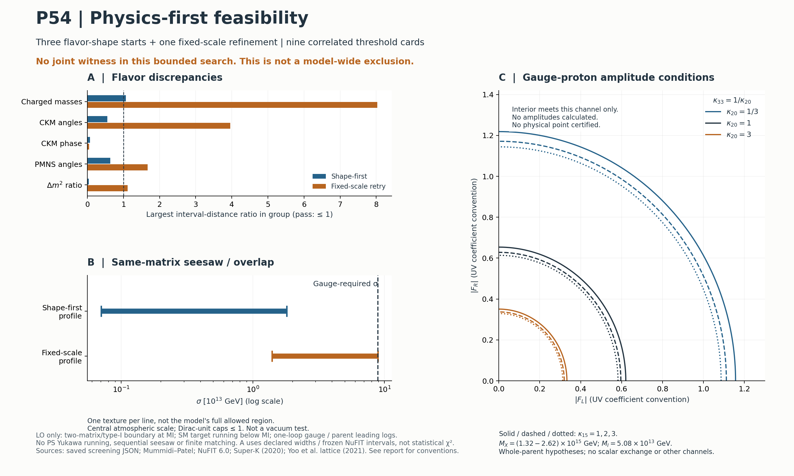

# P-PHYS1：物理優先的低階可行性篩選

日期：2026-09-22。Frozen P54PQ-v2 **僅作回歸測試**；本輪未調整任何舊純量參數。

## 結論與可行性圖

**這次有限搜尋尚未找到共同 flavor／seesaw 尺度候選，因此不啟動完整 matching 或物理極點計算。**
這不是全域最小值證書，也不是模型否證。三個預先指定的 flavor 起點，各最多 1000 次函數評估，
加一次固定尺度重試；沒有持續追加起點、放寬正式容差或重掃 quartic。

| 測試 | 實際結果 | 結論邊界 |
|---|---|---|
| 正確四-parent PS 單圈基準 | \(M_I=5.08\times10^{13}\)、\(M_X=M_U=1.90\times10^{15}\) GeV；\(\alpha_U^{-1}=38.22\) | 尖銳門檻／tree matching 近似，不是完整 P2 精密結果。 |
| 九張完整 parent 門檻卡 | \(M_X=(1.32–2.62)\times10^{15}\) GeV，\(M_I\) 不變 | 保持 D parity 的限定子集；不是作用量已實現的譜或信賴區間。 |
| Shape-first 最佳矩陣 | down Yukawa −31.97%，略超預先 30%；其餘八個 charged masses、四個 CKM 參數、三個 PMNS 角與質量平方差比通過 | 不把這兩個百分點當成重大物理否證；35% 政策敏感度另存，正式標準未事後修改。 |
| 同一 shape 的 seesaw 尺度 | capped overlap 族容許 \(\sigma=[7.04\times10^{11},1.80\times10^{13}]\) GeV | 統一要求 \(\sigma=M_I/g_4(M_I)=8.91\times10^{13}\) GeV，高出上限 4.94 倍。 |
| 唯一固定尺度重試 | overlap／尺度成立，但 muon Yukawa +80.28%；CKM angles、PMNS angles、質量平方差比亦未過 | 同時 fit 質量結構與共同尺度比各自單獨 fit 困難；本輪沒有共同 witness。 |
| 質子衰變 | 已給每張質量卡的 gauge-only 振幅不等式 | 實際 flavor amplitudes、scalar exchange、其他 channels 未算，沒有任何「質子衰變安全」點。 |

最值得保留的物理 insight 是 **flavor–seesaw 的共同尺度張力**，不是 down 質量距探索容差的邊界差。
甚至移除 Yukawa norm caps，shape-first 的純 overlap 正規化仍給
\(\sup\sigma=2.06\times10^{13}\) GeV，低於所需值 4.32 倍；
所以放寬 norm cap 也不能挽救這個固定 texture。但其他 texture 尚未被排除。

## 一、同一兩矩陣，不能獨立配四種 Yukawa

同一尺度與 family basis 上，只用複對稱 \(H',F'\)：

\[
Y_d=H'+F',\quad Y_e=H'-3F',\quad
Y_u=r(H'+sF'),\quad Y_\nu=r(H'-3sF').
\]

令 \(H'=a h_D,F'=d f_D,b=ra,e=rsd\)，取此參數化的 \(a,d\ge0,r>0\)，則

\[
a^2(1+r^2)+d^2(1+r^2|s|^2)=1,\qquad
M_R=\kappa\sigma f_D,\quad\kappa=i2\sqrt6.
\]

宣告 spectral norm caps \(h_*,f_*\)。由 \(a\ge\|H'\|_2/h_*\)、\(d\ge\|F'\|_2/f_*\)，
存在 normalized overlap 的充要條件為

\[
(1+r^2)\frac{\|H'\|_2^2}{h_*^2}
+(1+r^2|s|^2)\frac{\|F'\|_2^2}{f_*^2}\le1.
\]

反向取任一

\[
d_{\min}=\|F'\|_2/f_*\le d\le
d_{\max}=\sqrt{\frac{1-(1+r^2)\|H'\|_2^2/h_*^2}{1+r^2|s|^2}},
\]

由正規化式解出 \(a\)，即可重建原四種 Yukawas。零分母退化支不在本次非零 texture 搜尋中。
這是有效 overlap 的代數測試，**不保證存在對應的純量真空**。

純 type-I 假設下，

\[
m_\nu=-\frac{v_{174}^2d}{\kappa\sigma}Q,\qquad
Q=Y_\nu F'^{-1}Y_\nu^T,\qquad v_{174}=174\ {\rm GeV}.
\]

若 \(q_i\) 為 \(Q\) 遞增的 Takagi singular values，則

\[
\frac{\sigma}{d}=\frac{v_{174}^2}{|\kappa|}
\sqrt{\frac{q_3^2-q_1^2}{\Delta m_{31}^2}}.
\]

使用一致能量單位，程式顯式將 eV 轉 GeV。因此固定大氣中微子尺度後，
\(\sigma\) 不能再獨立指定：必須對接 gauge 要求，且所需 \(d\) 落在上述區間。

本圖 \(h_*=f_*=1\) 是 **Dirac-unit engineering cap**，不是完整 Yukawa 微擾證書；
JSON 另列 raw invariant、\(f_M=\kappa f_D\) norms，以及更嚴 Majorana-component cap、
較寬 Dirac-unit cap 的敏感度，沒有為通過而修改主 gate。

## 二、為什麼這批 gauge 門檻不能任意救 seesaw 尺度

正確四-parent PS census 給 \(b_{4,L,R}=(2/3,26/3,26/3)\)，不是已撤回的 \(b_4=1\)。
取 SM 順序 \((3,2,1_{\rm GUT})\)、\(P(4,L,R)=(4,L,2\,4/5+3\,R/5)\)，

\[
\alpha_i^{-1}(M_Z)=\alpha_U^{-1}
+\frac{b_i^{SM}}{2\pi}t+\frac{(Pb^{PS})_i}{2\pi}u
-\frac{(P\sum_A\Delta b_A\log\kappa_A)_i}{2\pi},
\quad t=\log\frac{M_I}{M_Z},\ u=\log\frac{M_U}{M_I}.
\]

所有質量 logs 都屬於完整 parent，不能為三個 gauge couplings 各設自由補償量。
保持 \(L=R\) 的 parent logs 被 \(A_1-\frac25A_3-\frac35A_2\) 消去。
因 SM beta 的同一組合為 \(44/5\)，

\[
\log\frac{M_I}{M_Z}=\frac{2\pi}{44/5}
\left[\alpha_1^{-1}-\frac25\alpha_3^{-1}-\frac35\alpha_2^{-1}\right]_{M_Z}.
\]

這解釋九張卡為何只移動 \(M_U\)，不能移動 \(M_I\)。移動的 parents 是
\(\Phi(20',1,1)\)、\(\Phi(1,3,3)\) 的互反 mass factors \(1/3,1,3\)，
及 \(\Sigma(15,2,2)\) 在 \(M_I\) 的 factors \(1,2,3\)；其餘 stage masses 不變。
未移動 Goldstone parent。

**作用範圍僅限此 LO／D-parity 門檻子集。** 中間向量固定分裂 logs、有限 gauge 常數、
two-loop running、輕 doublet thresholds、一般左右不對稱下端譜都尚未納入。
九卡 spread 不能當這些缺項的誤差上限。

## 三、質子衰變給可檢驗條件，不給虛假的成功區

定義

\[
C_{L,R}(2\,{\rm GeV})=\frac{g_U^2}{2M_X^2}A_{L,R}F_{L,R},\qquad
M_{X'}=g_U\sqrt{\omega^2+\sigma^2}.
\]

\(F\) 含 Fierz／Clebsch、同一 flavor 解的旋轉與第二向量干涉；不能任意設零。
採直接 lattice matrix element，不重複乘 chiral-Lagrangian 因子：

\[
\Gamma_{e\pi}=\frac{m_p}{32\pi}
\left(1-\frac{m_\pi^2}{m_p^2}\right)^2
|W_{\pi^0}|^2\bigl(|C_L|^2+|C_R|^2\bigr).
\]

基準點的條件是

\[
3.09879^2|F_L|^2+2.94180^2|F_R|^2<1.92336^2.
\]

若另一 chirality 為零，分別要求 \(|F_L|<0.6207\) 或 \(|F_R|<0.6538\)。
這不是模型的普遍 flavor 上限；尚未把真正的 \(F_L,F_R\) 畫進 ellipse。
使用 [Super-K 已發表的 \(2.4\times10^{34}\) yr 下限](https://arxiv.org/abs/2010.16098)
及 [Yoo et al. physical-pion lattice matrix elements](https://arxiv.org/abs/2111.01608)；
gauge anomalous factors 與 convention 見
[尺度子報告](p54_scales_lo_screen.md) 及其 [原始文獻](https://arxiv.org/html/1507.06712v2)。
這不是新聲稱的 2026 實驗結果或完整質子衰變計算。

## 四、明確否證／停止／續研規則

| 條件 | 判定範圍與行動 |
|---|---|
| 四種 Yukawa 必須獨立調整才能 fit | 否決該「共同兩矩陣」候選。 |
| 宣告 flavor 區間或 normalized-overlap／共同 \(\sigma\) 不滿足 | 否決該 LO texture/profile；不得新增獨立 \(M_R\) 尺度補救。 |
| \(M_Z<M_I<M_U\)、正 gauge coupling 或宣告的控制條件失敗 | 否決該完整 parent 質量卡。 |
| 同一 flavor 的實際 gauge amplitude 超出 ellipse | 否決該 gauge-only channel 假設；全模型結論仍需總振幅與其他 channels。 |
| overlap 通過，但真空／type-I dominance 未測 | 標記未測，不算物理解。 |
| 有限 multistart 未找到 witness | 記錄未找到，不宣稱已證明不存在。 |

**本輪停止在可行性篩選，不重啟 frozen benchmark rescue，不開始完整 matching。**
下一步只能是針對這個物理張力的有界測試，而非新增無限數學前置條件：

1. 如果保留 type-I，檢查其他 texture 能否在固定共同尺度下同時通過既定區間；
   預先設定探索預算，不能將一次 optimizer 失敗當證明。
2. 若張力持續，優先比較原作用量已含的 type-I+II 假設
   \(m_\nu=v_L f_M-v_{174}^2Y_\nu M_R^{-1}Y_\nu^T\)，不加第三個 flavor 矩陣。
   \(v_L\) 指規範已吸收於此式的有效 triplet VEV；其大小最終仍須由同一作用量實現。
   **本輪沒有做 type-II fit，也沒有聲稱已解決張力。**
3. 另一個有意義的敏感度是實際非退化下端譜對 \(M_I\) 的位移，
   不是重複這九張不會移動 \(M_I\) 的 D-parity 卡。

只有出現共同 LO witness，才算其同一 flavor 的 proton amplitudes、
檢查對應少數 parent 質量與 overlaps 能否來自穩定作用量；仍有希望者才投入完整 matching、
逐 \(M_N\) seesaw 與物理極點。未完成的每個精密項不再自動產生一篇新推導。

## 五、可重現性與未測項

~~~sh
python3 route_f/code/screen_p54_scales_lo.py
python3 route_f/code/screen_p54_flavor_lo.py
python3 route_f/code/build_p54_physics_first_screen.py
~~~

完整矩陣、逐項殘差、起點、搜尋界限、\(M_N\)、norms、來源 hashes 與省略的 leading-log 指標保存在
[flavor JSON](p54_flavor_lo_screen.json)、[flavor 報告](p54_flavor_lo_screen.md)、
[尺度 JSON](p54_scales_lo_screen.json) 與
[交叉對接／圖中每列 provenance](p54_physics_first_screen.json)。
數值／代數／來源 checks 通過，**不等於物理篩選通過**。沒有新增長篇 TeX。

主要 flavor 輸入來自 [Mummidi–Patel Table II](https://arxiv.org/html/2109.04050v2)、
[NuFIT 6.0](https://arxiv.org/abs/2410.05380)；不同 EFT 的文獻解只作起點，全部重新檢驗。
charged 10%／light-quark 30%、CKM 10%／0.12-rad 是探索政策，不是實驗一標準差；
NuFIT normal-ordering 的固定區間也不是此次完整共同 likelihood。

在 \(M_I\) 施加 tree 兩矩陣關係是明確宣告的 LO proxy，不是已完成的 Spin(10) UV fit。
\(M_U\to M_I\) PS Yukawa 演化、sterile feedback／逐門檻、neutrino RG、有限 matching、
type-II decoupling、真空可實現性、完整微擾性、PQ cosmology 都未默認通過。
固定尺度重試有一個 \(M_N\simeq1.34M_I\)，提醒共同尖銳 seesaw 門檻僅是近似；
JSON 的小 leading-log 指標不是完整 matrix-RGE 或門檻誤差證書。

另有明確的小型輸入差異：flavor target transport 沿用的 gauge 邊界卡，與本次 gauge screen
並非同一精密輸入卡，在 \(M_I\) 的 \(g_2\) 相差約 0.617%。**本輪已對接共同尺度與
\(\sigma\)，未聲稱完成精密輸入統一**；差值保存在交叉對接 JSON。這不應被升格成新 blocker，
也沒有據此重跑 fit 或宣稱它能解釋此固定 texture 的 4.94 倍尺度差。
